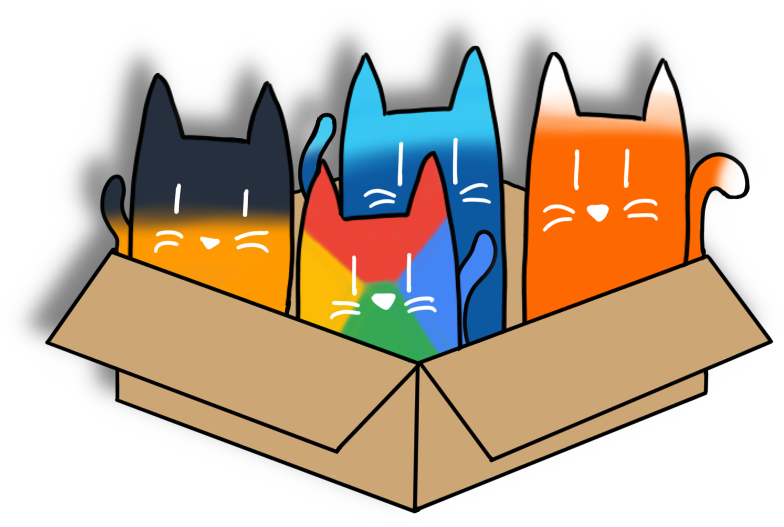

# Box

<p align="center">
  
</p>

Box is an annotation-driven framework for building APIs that deploy seamlessly to hybrid cloud infrastructure. Write your handlers once with simple comment annotations, and Box automatically generates the deployment artifacts, OpenAPI specs, and infrastructure-as-code for Google Cloud Platform.

The framework supports both serverless (Cloud Functions) and container (Cloud Run) deployments from the same codebase. Use `@box:function` for short-lived, stateless endpoints and `@box:container` for long-running connections like WebSockets or Server-Sent Events. Box handles routing, middleware (CORS, auth, rate limiting), and deployment configuration through annotations.

Currently supports **Go** and **TypeScript/JavaScript**, with Python and other languages planned. Each language implementation provides the same annotation syntax and generates compatible deployment artifacts, making it easy to build polyglot microservices.

## Installation

### Box CLI (Universal)

The unified Box CLI can scaffold and build projects in **any supported language** from a single binary.

#### Linux / macOS

**One-line installer:**
```bash
curl -sSL https://raw.githubusercontent.com/gravelight-studio/box/main/install.sh | sh
```

#### Windows

**PowerShell installer:**
```powershell
iwr -useb https://raw.githubusercontent.com/gravelight-studio/box/main/install.ps1 | iex
```

#### Manual Installation

**Build from source:**
```bash
git clone https://github.com/gravelight-studio/box.git
cd box/cli
go build -o bin/box ./cmd/box
```

**Download binary from [GitHub Releases](https://github.com/gravelight-studio/box/releases)**

### Language Libraries

If you prefer to work with language-specific tools:

**Go:**
```bash
go get github.com/gravelight-studio/box
```

**TypeScript/JavaScript:**
```bash
npm install @gravelight-studio/box
```

## Quick Start

### Create a new project:

```bash
# Interactive wizard
box init my-app

# Or specify language directly
box init my-go-api --lang go
box init my-ts-api --lang typescript
```

### Example Handler:

**Go:**
```go
// @box:function
// @box:path POST /api/users
// @box:auth required
// @box:ratelimit 100/hour
func CreateUser(db *pgxpool.Pool, logger *zap.Logger) http.HandlerFunc {
    return func(w http.ResponseWriter, r *http.Request) {
        // Your handler logic
    }
}
```

**TypeScript:**
```typescript
import { Request, Response, HandlerFactory, Logger } from '@gravelight-studio/box';

// @box:function
// @box:path POST /api/users
// @box:auth required
// @box:ratelimit 100/hour
export const createUser: HandlerFactory = (db, logger) => {
  return (req: Request, res: Response) => {
    // Your handler logic
  };
};
```

### Build and deploy:

```bash
# Generate deployment artifacts (auto-detects language)
box build --project my-gcp-project

# Deploy with Terraform
cd build/terraform
terraform init && terraform apply
```

## Documentation

- **[Unified CLI Documentation](cli/README.md)** - Universal CLI for all languages
- **[Go Library Documentation](go/README.md)** - Full API reference and annotation guide
- **[TypeScript Library Documentation](typescript/README.md)** - TypeScript/JavaScript API reference
- **[Go Example Application](examples/go/)** - Complete working example
- **[TypeScript Example Application](examples/typescript/)** - Complete working example

## Repository Structure

```
Box/
├── cli/                     # 🆕 Unified CLI (Go binary, all languages)
│   └── cmd/box/
│       ├── main.go         # CLI entry point
│       └── templates/      # Embedded project templates
├── go/                      # Go implementation
│   ├── annotations/         # Annotation parser
│   ├── router/             # HTTP router with middleware
│   └── build/              # Deployment artifact generator
├── typescript/              # TypeScript/JavaScript implementation
│   └── src/
│       ├── annotations/     # Annotation parser
│       ├── router/         # Express router with middleware
│       ├── build/          # Deployment artifact generator
│       └── cli/            # CLI tool (used by unified CLI)
├── examples/
│   ├── go/                 # Go example application
│   └── typescript/         # TypeScript example application
└── .github/workflows/      # CI/CD for releases
```

## Contributors

Thanks to all contributors who have helped make Box better!

<a href="https://github.com/gravelight-studio/box/graphs/contributors">
  
</a>

## Funding

Box is open source and free to use. If you find it valuable, consider supporting its development:

- **[GitHub Sponsors](https://github.com/sponsors/gravelight-studio)** - Sponsor ongoing development
- **[Open Collective](https://opencollective.com/box)** - One-time or recurring contributions

Your support helps maintain the project, add new language implementations, and improve documentation.

## License

MIT
